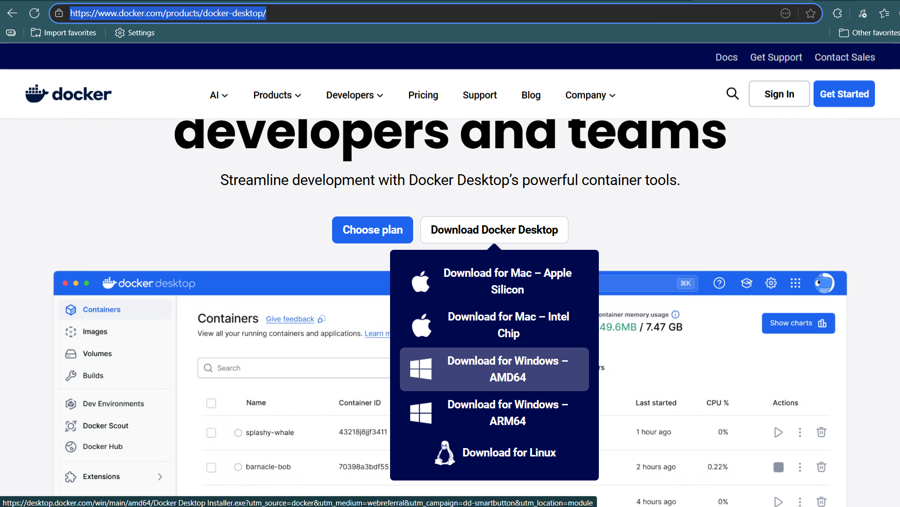
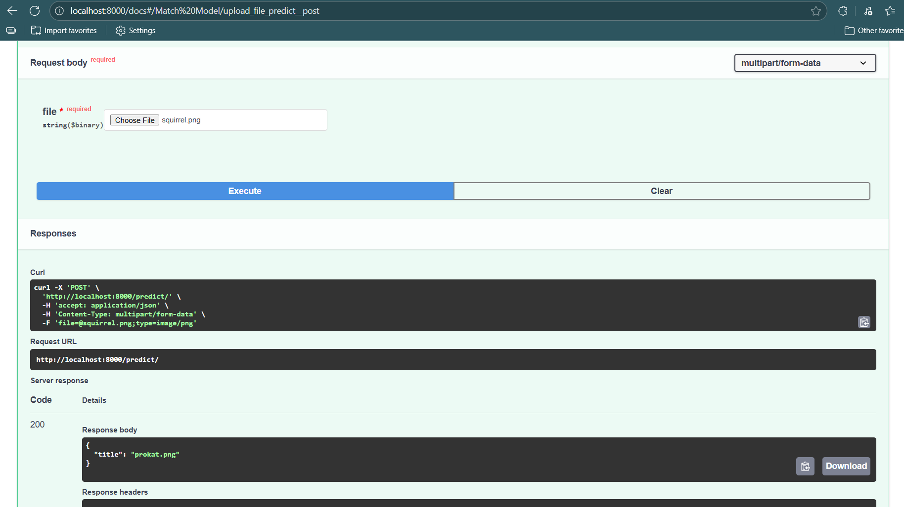
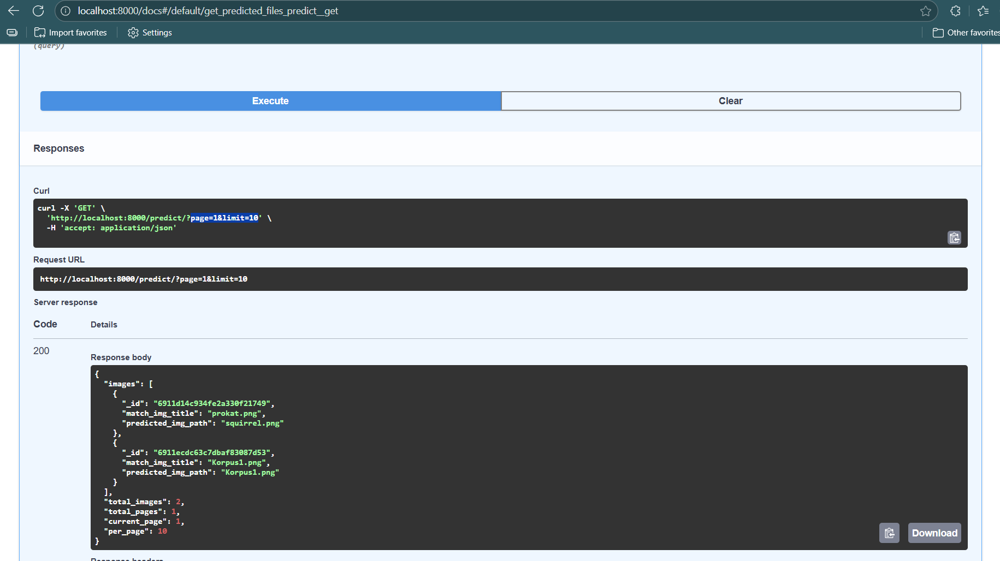
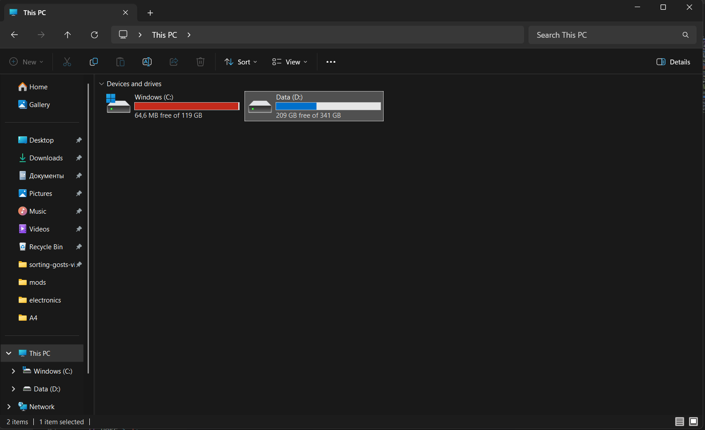

## About this project

This project contains the module with math model that is able to predict the most similar image (blueprint/development, 998x1409 pixels)
among existed images (in folder A4). Also this project contains the module with server where we can test our model by uploading test images.


## Idea of the model

The model consists of two steps: preparation images and calculating distances.

### Preparation of images

First we make an image gray.
Then we scale it to values in range from 0 to 1.  
After that we make them flat.
Image is normalized if it passed this preparation. Such image will be adopted to our model
because it has data within range from 0 to 1 (it will be important for calculating distances).
Then we use PCA (principal components analysis) to find the most valuable components of our images
so we can remove noises and focus on the most important information.

| Step | Data type | Shape |
| ---- | --------- | ----- |
| Loading img | BGR [0-255, 0-255, 0-255] | (998, 1409) |
| Converting to gray | gray 0-255 | (998, 1409) |
| Scaling img | gray 0-1 | (998, 1409) |
| Flatten img| gray 0-1 | (998 $\cdot$ 1409) |
| Using PCA | float | n components |

### Calculating the most closed image

We calculate distance between normalized existing and uploaded images.
The distance is a symmetric always-non-negative function (In our project we only use Minkowski distances).
Among all existing images we pick the one image that has min distance with uploaded one.

So if $X$ is a set of normalized images, $y$ is an uploaded image and $m$ is a matched image: 

$m = \underset{x \in X}{\text{arg}} \hspace{0.2em} \underset{x \in X}{\text{min}} \hspace{0.2em} d(x, y)$

## Possible improvements

- This project can be extended to using other formats of developments/blueprints (A3, A2, ...) by using the same
  number of main components so prepared data will have the same dimensions (but we should use different PCA model for each format,
  it might not work because the components may be too different).
- We can create a logger instead of usual printing in the function `predict_match_img` so we can store training results more easily (e.g. put
  the result in logs.txt).
- This algo can be improved if developers/engineers will make kind of additional standardization about placing detail on the blueprint (make only one position and exactly coordinates + defining the same view for all details).
- We can extract first only informative tables and panels in developments (e.g. a table with material, plane of detail, ...).
- We can actually hire an engineer that can say what is the most "similar" imgs so we can setup feedback for our model
  (+it allows us to define the best distance function).
- The blueprints/developments should be from one sphere (e.g. only molds, engines, ...) so our model will work better for some specific blueprints/developments.

## Mini-usage documentation

This project has a few useful functions: predict_match_img,
normalize_bgr_image.

### `predict_match_img`

#### Inputs

- `normalized_img: List[float]` is a list that consists of gray pixels that are coded in the range 0-1.
- `components: List[List[float]]` is a list that consists of main components from PCA.
- `avg_data: List[float]` is a list that consists of mean values of properties of initial data.
- `reduced_data: List[List[float]]` is a list (dataframe) that consists of transformed initial data by PCA.
- `dist_func: (function(p1: List[float], p2: List[float], dim: int)->float` is a function that satisfies distances requirements (>=0, symmetric, =0 if points are the same).

#### Output

- `match_index: (int>=-1)` is an index of matched img in initial/reduced data (if -1 -> not found).

#### Example

```
import read_normalize_img from utils
import distances, predict_match_img from predicting_model

reduced_data = pd.read_csv("reduced_data.csv")
model_params = {}
with open("model_params.json", "r") as file:
    model_params = json.load(file)
test_img = read_normalize_img("./", "./squirrel.png")

match_index = predict_match_img(test_img, model_params["components"],model_params["avg_data"], reduced_data, distances["euclid"])
print(reduced_data.iloc[match_index, "title"])
```

### `normalize_bgr_img`

#### Input

- `img: file` is an img that is read as cv2.imread("./img_path").

#### Output

- `normalized_img: List[float]` is a list of gray scaled pixels.

#### Example

```
import os
import cv2
import normalize_bgr_img from utils

img_path = os.path.join("./A4", "cap.png")
img = cv2.imread(str(img_path))
norm_img = normalize_bgr_img(img)

"""
actually there are functions: read_normalize_img and read_normalize_imgs
first one accepts folder_path and folder_name, second one accepts folder_path
they read images with cv2 and then normalize them by function normalize_bgr_img
they return normalized img(s).
""" 
```

## Setup launching [19:34, November 10, 2025]

To setup this project we need to install Docker on our device (Docker Desktop in case we use Windows): https://www.docker.com/products/docker-desktop/. 



After installing launch Docker Desktop and sign in so we will be able to pull images. 

First we're going to pull mongo image: `docker pull mongo`. 

Then create a container with the name "mongodb" (don't use another one because in other case we must change this name in docker-compose.yml file; modify only rootpassword - password that we'd like to use): `docker run -d --name mongodb -p 27017:27017 -e MONGO_INITDB_ROOT_USERNAME=root -e MONGO_INITDB_ROOT_PASSWORD=rootpassword mongo:latest`. To check if database with root user is created: `docker exec -it mongodb mongosh` or `docker run --rm -it --network yournetwork(usually localhost or mongodb) mongo mongosh --host mongodb -u root -p rootpassword --authenticationDatabase admin` (if root user isn't created then also in mongoshell: `use admin`, `db.createUser({    user: "root",    pwd: "rootpassword",    roles: [ { role: "root", db: "admin" } ]})`, `exit`, so we can also create other users if we'd like to use them instead of root in our project).

Once we've created  mongodb container with root user, then we should define our .env file in root directory. It should have following variables as in the code cell below (use our password that was defined previously, change the root username if we used another one when we were creating the user, the name of database can be any):
```
MONGO_INITDB_ROOT_USERNAME=root
MONGO_INITDB_ROOT_PASSWORD=rootpassword
MONGO_DATABASE=predicted_images_db
```

And now we can do the last command: `docker-compose up --build`. It will start setup our project by docker-compose.yml and Dockerfile. It will be done when we see the message from fastapi that App is started on our host. 

The result of working server:
- Predicting a matched image to an uploaded one:


- Getting all predicted images with their matches (pagination is included):


### Warning

Installation of Docker Desktop will also require to install Sub Linux system for Windows. And when we pull images and create containers it might take about 20Gb (I had 20Gb free on my disk C before making Docker things):


